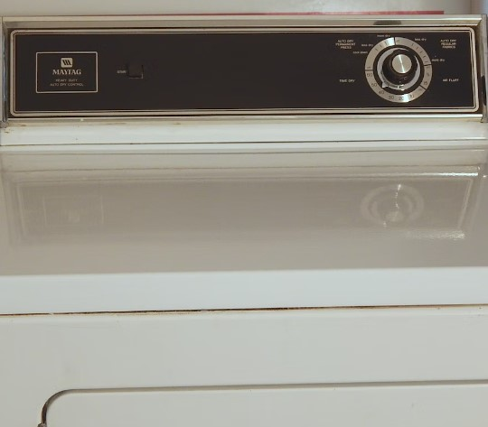

## Embedded Dryer System
An embedded system is a computer system that has a dedicated function within a larger mechanical or electronic system. This is an embedded system for a 1980's Maytag Dryer. The schema is layed out below:  
### **Cycles:**
#### Air Fluff:
* Blower
* Timer
#### Auto Dry (Regular Fabrics):
* Blower
* Timer
* Heating Element
* Thermostat
* Moisture Sensor
#### Auto Dry (Press Care):
* Blower
* Timer
* Heating Element
* Thermostat
* Moisture Sensor
#### Timed Dry:
* Blower
* Timer
* Heating Element
#### Cool Down:
* Blower
* Timer
### **Requirements:**
* Reliable electrical power must be supplied. 
* Dryer door must be closed prior to operation. 
* Proper dryer vent must be fitted.  

###### Please note this system is for eductational use only, not to be used for any commercial or professional application. Copyright 2022 Tanner Ellingson.

